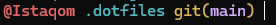

# Dotfiles Repository

This repository contains my personal dotfiles and configuration files for various tools and applications.

## 📁 Repository Structure

```
.dotfiles/
├── .oh-my-posh-themes/     # Oh My Posh theme configurations
│   └── zash.minimal.omp.json
├── .oh-my-zsh-themes/     # Oh My Zsh theme configurations
│   └── istaqom.zsh-theme
├── images/                 # Screenshots and documentation images
│   └── oh-my-posh-themes.png
└── README.md              # This file
```

## 🎨 Oh My Posh Themes

This repository includes custom Oh My Posh themes for PowerShell terminal customization.

### Available Themes

#### Zash Minimal Theme
- **File**: `.oh-my-posh-themes/zash.minimal.omp.json`
- **Description**: A clean, minimal theme with color-coded segments for user, path, git status, and system status
- **Colors**: 
  - User: `#E36464` (Red)
  - Path: `#56B6C2` (Cyan)
  - Git: `#D4AAFC` (Purple) with `#DDB15F` (Gold) brackets
  - Status: `#DCB977` (Gold)



### Theme Features

- **Session Display**: Shows current username
- **Path Display**: Shows current directory path
- **Git Integration**: Displays current branch and git status
- **Status Indicator**: Shows system status with `!` symbol
- **Clean Layout**: Left-aligned, minimal design

## 🎨 Oh My Zsh Themes

This repository also features custom themes for Oh My Zsh, enhancing the look and feel of your terminal experience.

### Available Themes

#### Istaqom Theme
- **File**: `.oh-my-zsh-themes/istaqom.zsh-theme`
- **Description**: A visually appealing prompt with clear segmentation for user, host, working directory, and git branch/status.
- **Colors**: 
  - User/Host: Subtle blue to green transition
  - Directory: Bold cyan for clarity
  - Git Info: Highlighted with vibrant magenta
  - Symbols: Clean separator and succinct git status icons


### Theme Features

- **User and Host Display**: Clearly shows the current username and machine
- **Directory Path**: Prominently displays the current working directory
- **Git Integration**: Presents the current branch and concise git status symbols
- **Prompt Symbols**: Minimalist arrow prompt for readability
- **Consistent Spacing**: Ensures prompt elements don’t clutter


## 📄 License

This project is open source and available under the [MIT License](LICENSE).

---

